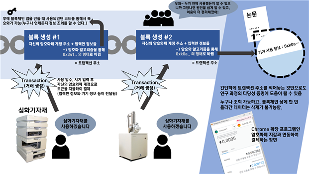

# jeju_equipment_lend_system_blockchian

jeju science high school research upgrade version / make dapp with ethereum
(ethereum dapp) 블록체인 기반의 제주도 내 심화기자재 공유 서비스 

## 1. 작품의 목적
현재 본교에 있는 심화기자재들을 사용하는 데 있어서 타교 학생들이 어려움을 겪을 때가 많다. 또한 창업지원센터나 관련 기관에서 사용할 수 있는 기자재들이 존재하지만 많이 알려지지 않았고 접근성이 낮다. 이런 기자재들을 쉽게 파악하고 사용할 수 있도록 기자재 공유 서비스를 구축하려 한다. 블록체인 상에 사용 기기 및 사용자 정보를 올려 누구나 볼 수 있도록 투명성을 구현하고, 한 번 올린 데이터를 수정할 수 없다는 점을 이용하고자 한다. 이를 ethereum 블록체인 smart contract 기반으로 제작하였다. 

## 2. 작품요약

학교 선생님들끼리 연락을 하거나 다른 방식을 취해서 일정량의 토큰을 지급받으면, 그 토큰을 이용하여 심화기자재를 사용할 수 있게 예약을 할 수 있다. 논문에 트랜젝션 코드를 삽입하면 연구 과정의 타당성을 증명할 수 있다는 데에서 차별화된 기능을 구축하였다.

## 3. 제작 결과
https://youtu.be/_Nns5l3UNPc
